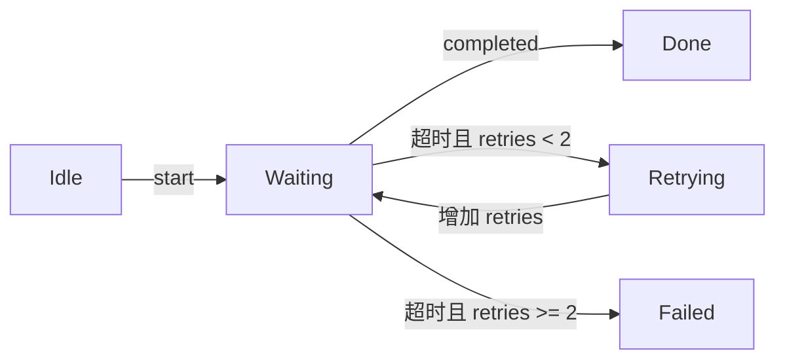

# v0.1 验证报告

**日期：** 2026-10-04  
**范围：** 技能格式、文件引用与收敛设计的十个合成场景  
**结果：** 格式验证通过，引用可访问，十个行为案例均通过本次审阅

## 验证方法

使用 `skill-creator` 提供的 `quick_validate.py` 检查技能元数据、名称、描述及未完成占位项，工具返回 `Skill is valid!`。另检查技能目录只包含入口与图示参考两份文件，且入口引用的图示参考存在。

按 `skill-creator` 的独立前向试用方法，一名子智能体在一次会话中显式加载技能，处理下列十个独立合成场景。它只获得请求、证据和宿主能力，不读取设计稿、评审结论或预期答案。主智能体随后按收敛设计审阅完整输出。

**下文文件名、测试记录、费用和测量值均属于合成案例材料，不是本仓库中的实际代码改动、真实测试结果或真实业务数据。**

## 行为验收结果

| 案例 | 观察到的行为 | 结果 |
| --- | --- | --- |
| C01 | 简短说明三处注释替换，保留未运行测试状态 | 通过 |
| C02 | 揭示完成、重试和失败分支；未编造初始重试次数 | 通过 |
| C03 | 采用比较表格，保留 A 迁移难度未知与费用估计性质 | 通过 |
| C04 | 遵守纯文本要求，限定五项测试的覆盖范围 | 通过 |
| C05 | 明确未运行测试或构建，没有把修改完成说成行为已验证 | 通过 |
| C06 | 保留 310 ms、180 ms，计算降幅约 41.9%，未推断稳定性或因果 | 通过 |
| C07 | 区分时间先后与因果，明确原因未知 | 通过 |
| C08 | 使用文本关系图回退，没有虚构视觉验证 | 通过 |
| C09 | 报告本地完成、六项断言通过及端到端阻塞 | 通过 |
| C10 | 以实际代码为准指出旧图分支反转，保留未运行测试状态 | 通过 |

## 验证边界

本轮检查显式加载后的行为，不验证宿主会自动发现或调用技能。未在 Codex、Claude Code 或其他宿主分别进行端到端安装测试，也未渲染和检查案例中的 Mermaid 图示。

十个合成场景的一次试用不足以证明技能持续可靠，也没有测量真实用户的理解速度、错误发现率或追问负担。后续真实使用应按[收敛设计](../human-comprehension-skill-design-zh.md)继续收集反馈。

## 完整案例与试用输出

### C01

**请求：** 用中文告诉我这次改了什么。

**已有证据：** src/a.ts、src/b.ts、src/c.ts 的注释中将 expiry 统一改为 expiration。没有行为、调用关系或配置变化。未运行测试。

**宿主能力：** 呈现能力未知。

**实际试用输出：**

~~~text
本次仅将 src/a.ts、src/b.ts、src/c.ts 注释中的 expiry 统一改为 expiration。行为、调用关系和配置没有变化；未运行测试。
~~~

### C02

**请求：** 用中文解释 worker 的状态与超时处理，让我能检查分支。

**已有证据：** 唯一改动文件 src/worker.ts。代码记录：Idle 收到 start 后进入 Waiting；Waiting 收到 completed 后进入 Done；Waiting 超时且 retries < 2 时进入 Retrying；Retrying 增加 retries 后回到 Waiting；Waiting 超时且 retries >= 2 时进入 Failed。相关测试未运行。

**宿主能力：** 已确认支持基本 Mermaid flowchart。

**实际试用输出：**

~~~text
src/worker.ts 的状态分支如下：Waiting 收到 completed 时进入 Done；发生超时时，根据 retries 是否小于 2 决定重试或失败。箭头表示状态转换，箭头文字表示触发条件或操作。



检查分支时，重点看：小于 2 时先进入 Retrying、增加 retries，再回到 Waiting；等于 2 时已走 Failed 分支。材料没有给出 retries 初始值，因此不能确定总尝试次数。相关测试未运行，以上说明依据代码记录。
~~~

### C03

**请求：** 用中文比较这三个方案。迁移难度会影响我的选择，请说明目前能判断到哪里。

**已有证据：** 任务内方案记录：A 月预算估计20美元，迁移难度未知，能在本地核验；B 月预算估计50美元，迁移难度低，需要供应商沙箱核验；C 月预算估计35美元，迁移难度中，能在本地核验。这些是当前方案估计，不是已经发生的支出。

**宿主能力：** 普通文本与 Markdown 表格可用。

**实际试用输出：**

~~~text
当前可以比较月预算估计和核验条件，但 A 的迁移难度未知，会影响最终选择。

| 方案 | 月预算估计 | 迁移难度 | 核验条件 |
| --- | --- | --- | --- |
| A | 20 美元/月 | 未知 | 可在本地核验 |
| B | 50 美元/月 | 低 | 需要供应商沙箱核验 |
| C | 35 美元/月 | 中 | 可在本地核验 |

按当前估计，A 预算最低；B 迁移难度低，但预算最高且需要供应商沙箱；C 的预算介于两者之间，迁移难度为中，可在本地核验。

若优先考虑迁移难度，B 是当前记录中难度最低的方案，但尚不能将它排在 A 前面，因为 A 的难度未明确。应先补齐 A 的迁移评估，再结合预算和核验条件作最终选择。上述金额是方案估计，并非已经发生的支出；材料也未提供实际核验结果。
~~~

### C04

**请求：** 请用纯文本解释这次认证改动，不要画图或表格。

**已有证据：** login.ts 创建 expiresAt；session.ts 比较 expiresAt 与当前时间；middleware.ts 对过期会话返回401，对有效会话继续请求。观察记录 auth-tests.txt：5项认证测试通过。外部会话存储未验证。

**宿主能力：** 支持 Mermaid 和 Markdown 表格。

**实际试用输出：**

~~~text
这次认证改动通过 expiresAt 判断会话是否过期：login.ts 创建 expiresAt，session.ts 将它与当前时间比较，middleware.ts 对过期会话返回 401，对有效会话继续处理请求。

auth-tests.txt 记录了 5 项认证测试通过。外部会话存储尚未验证，因此这些测试结果不能说明外部会话存储场景已经验证完成。
~~~

### C05

**请求：** 用中文交代修复状态和验证情况。

**已有证据：** 已在 session.ts 增加过期判断。没有运行单元测试、集成测试或构建。当前只有改动内容可供检查。

**宿主能力：** 普通文本可用。

**实际试用输出：**

~~~text
已在 session.ts 增加过期判断，当前可检查改动内容，修复效果尚未验证。单元测试、集成测试和构建均未运行，因此还不能确认过期处理在实际运行中符合预期。
~~~

### C06

**请求：** 用中文解释时延数值的变化。

**已有证据：** 本任务记录的两次测量分别是310 ms和180 ms。没有提供样本量、统计区间或控制变量。

**宿主能力：** 普通文本可用。

**实际试用输出：**

~~~text
记录中的时延从 310 ms 变为 180 ms，减少 130 ms；以 310 ms 为基准，降幅约为 41.9%（130 ÷ 310）。

这些数值只说明两次测量记录的差异。材料未提供样本量、统计区间或控制变量，无法据此判断改善是否稳定，或将变化归因于某项改动。
~~~

### C07

**请求：** 用中文解释这个故障目前能确定的原因。

**已有证据：** 部署开始时间14:00，第一条错误记录时间14:03。没有调用跟踪、复现实验或其他直接因果证据。当前还不知道两者是否存在因果关系。

**宿主能力：** 支持 Mermaid。

**实际试用输出：**

~~~text
目前还不能确定故障原因。记录只能确认：部署于 14:00 开始，第一条错误出现在 14:03，时间相隔 3 分钟。

这个先后顺序不足以证明部署导致了错误。当前没有调用跟踪、复现实验或其他直接因果证据，两者是否存在因果关系仍未知。
~~~

### C08

**请求：** 用中文解释这个请求流程，让关系容易看懂。

**已有证据：** 流程记录：请求进入handler；handler先读取cache；cache命中时返回cached值；cache未命中时handler调用provider，并返回provider结果。

**宿主能力：** Mermaid 支持未知；没有渲染或截图工具。普通文本可用。

**实际试用输出：**

~~~text
请求进入 handler 后，handler 先读取 cache，再根据是否命中选择返回路径：

```text
请求进入 handler
  |
  v
handler 读取 cache
  |
  +-- 命中：handler 返回 cached 值
  |
  +-- 未命中：handler 调用 provider
                 |
                 v
             handler 返回 provider 结果
```

图中箭头表示执行顺序。provider 只在 cache 未命中时被调用；材料没有描述缓存写入或 provider 失败时的处理。
~~~

### C09

**请求：** 用中文交代当前成果、证据和接下来的阻塞。

**已有证据：** 本地数据映射器已完成。mapping-tests.txt记录6项映射断言通过。外部API返回402，端到端校验未完成。任务要求的完整端到端结果尚未交付。

**宿主能力：** 普通文本可用。

**实际试用输出：**

~~~text
当前成果是本地数据映射器已完成；任务要求的完整端到端结果尚未交付。

mapping-tests.txt 记录了 6 项映射断言通过，这支持本地映射部分的验证结果。外部 API 返回 402，端到端校验因此未完成；当前材料没有说明该响应的具体原因。

接下来的阻塞是外部 API 调用。需要先查明并解决 402 响应，再完成端到端校验，才能确认完整流程的结果。
~~~

### C10

**请求：** 根据这些材料用中文给出最终说明，必要时配图。

**已有证据：** 实际 middleware.ts：valid分支继续请求；expired分支返回401。说明草稿：有效会话继续请求，过期会话401。旧图示草稿：valid -> 401；expired -> continue。未运行测试。

**宿主能力：** 已确认支持基本 Mermaid flowchart。

**实际试用输出：**

~~~text
以实际 middleware.ts 为准：valid 分支继续请求，expired 分支返回 401。说明草稿与代码一致。

旧图示把这两个分支画反了，应将 valid → 401 改为 valid → continue，将 expired → continue 改为 expired → 401。

未运行测试，因此当前只能确认代码与说明之间的对应关系，尚未验证运行行为。
~~~
